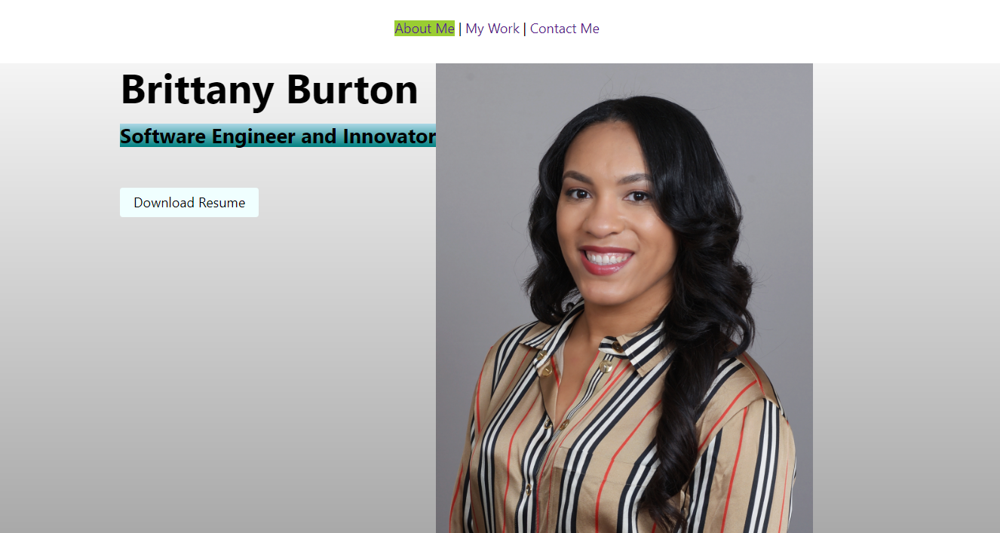

# Brittany's Portfolio

## Description

The purpose of this portfolio is to capture the skills that were learned in bootcamp and put into one place so that employers can evaluate my talents and determine if I am a great candidate for their company. This helps employers not only read about the work that I have done, but also gives them the ability to view my capabilities. I learned in the process of building this portfolio that there are several ways to code, but there's always room to simplify, clean up, and improve.

## Installation

N/A

## Usage

To navigate Brittany's Portfolio, click the above links to scroll to that section of the page. Example, if you click 'About Me', the page will jump down to the About Me section.

## Credits

https://developer.mozilla.org/en-US/docs/Web/CSS

https://developer.mozilla.org/en-US/docs/Web/CSS/CSS_Flexible_Box_Layout/Basic_Concepts_of_Flexbox

https://www.w3schools.com/howto/howto_css_hero_image.asp

Create a Website "About Me" Section by using only HTML and CSS | Portfolio Website part Four
https://www.youtube.com/watch?v=7dlbtDkQ1zc

How to create a simple hero section with HTML & CSS
https://www.youtube.com/watch?v=fs923Mu5EXY

## License

MIT License

Copyright (c) 2022 Brittany Burton

Permission is hereby granted, free of charge, to any person obtaining a copy of this software and associated documentation files (the "Software"), to deal in the Software without restriction, including without limitation the rights to use, copy, modify, merge, publish, distribute, sublicense, and/or sell copies of the Software, and to permit persons to whom the Software is furnished to do so, subject to the following conditions:

The above copyright notice and this permission notice shall be included in all copies or substantial portions of the Software.

THE SOFTWARE IS PROVIDED "AS IS", WITHOUT WARRANTY OF ANY KIND, EXPRESS OR IMPLIED, INCLUDING BUT NOT LIMITED TO THE WARRANTIES OF MERCHANTABILITY, FITNESS FOR A PARTICULAR PURPOSE AND NONINFRINGEMENT. IN NO EVENT SHALL THE AUTHORS OR COPYRIGHT HOLDERS BE LIABLE FOR ANY CLAIM, DAMAGES OR OTHER LIABILITY, WHETHER IN AN ACTION OF CONTRACT, TORT OR OTHERWISE, ARISING FROM, OUT OF OR IN CONNECTION WITH THE SOFTWARE OR THE USE OR OTHER DEALINGS IN THE SOFTWARE.
